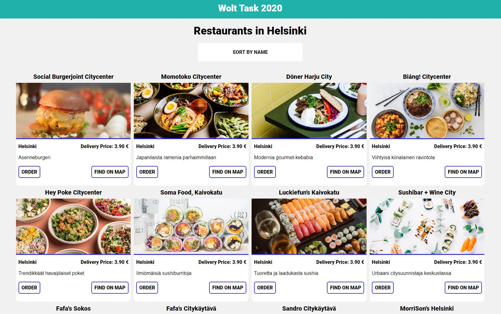

This is the Front-End task for Wolt Summer Internship 2020

# Final App Preview

The WOLT task details can be found here [https://github.com/woltapp/summer2020](https://github.com/woltapp/summer2020)

# Run Source Files

Download or clone the repo and and install dependencies using 
### `npm install` 

After installation you can start this react app using 

### `npm start`

This app was built with creat-react-app
